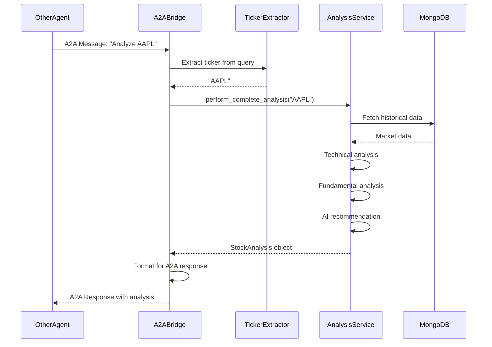
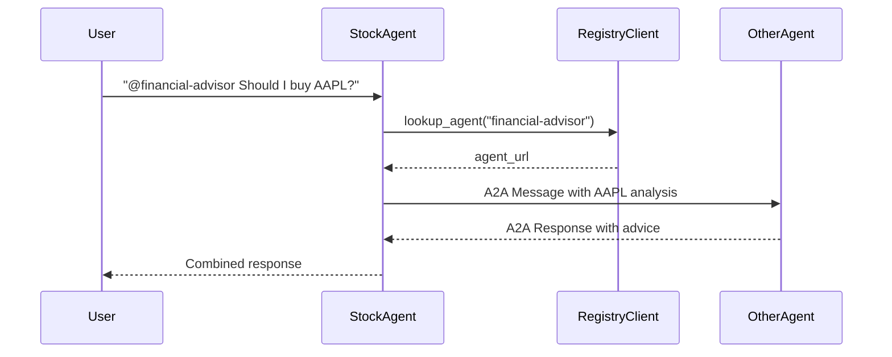

# NEST Integration Design Document

## Overview

This design document outlines the integration of the NASDAQ Stock Agent with the NEST (NANDA Sandbox and Testbed) framework. The integration will enable the stock agent to participate in the NANDA agent network, allowing it to communicate with other agents via the A2A (Agent-to-Agent) protocol while maintaining its existing FastAPI functionality.

The integration follows a modular, non-invasive approach that allows the agent to operate in both standalone mode (existing functionality) and NEST mode (with A2A communication).

## Architecture

### High-Level Architecture

```
┌─────────────────────────────────────────────────────────────┐
│                   NASDAQ Stock Agent                         │
│                                                              │
│  ┌────────────────┐         ┌──────────────────┐           │
│  │  FastAPI App   │         │  NEST Adapter    │           │
│  │  (Existing)    │         │  (New)           │           │
│  │                │         │                  │           │
│  │  /analyze      │         │  A2A Bridge      │           │
│  │  /health       │         │  Registry Client │           │
│  │  /history      │         │                  │           │
│  └────────────────┘         └──────────────────┘           │
│         │                            │                      │
│         └────────────┬───────────────┘                      │
│                      │                                      │
│         ┌────────────▼────────────┐                        │
│         │  Analysis Service       │                        │
│         │  (Shared Core Logic)    │                        │
│         └─────────────────────────┘                        │
└─────────────────────────────────────────────────────────────┘
                       │
        ┌──────────────┼──────────────┐
        │              │              │
        ▼              ▼              ▼
  ┌─────────┐   ┌──────────┐   ┌──────────┐
  │ MongoDB │   │  NANDA   │   │  Other   │
  │         │   │ Registry │   │  Agents  │
  └─────────┘   └──────────┘   └──────────┘
```

### Component Architecture

The integration consists of three main components:

1. **NEST Adapter** - Wraps the stock agent logic for NEST framework
2. **A2A Bridge** - Handles incoming/outgoing A2A messages
3. **Registry Client** - Manages agent registration and discovery

## Components and Interfaces

### 1. NEST Adapter (`src/nest/adapter.py`)

The NEST adapter is the main entry point for NEST integration. It wraps the stock agent's analysis logic and exposes it via the A2A protocol.

```python
class StockAgentNEST:
    """NEST adapter for NASDAQ Stock Agent"""
    
    def __init__(
        self,
        agent_id: str,
        port: int,
        registry_url: Optional[str] = None,
        public_url: Optional[str] = None,
        enable_telemetry: bool = True
    ):
        """Initialize NEST adapter with configuration"""
        
    async def agent_logic(self, message: str, conversation_id: str) -> str:
        """Process incoming A2A messages and return stock analysis"""
        
    def start(self, register: bool = True):
        """Start the NEST agent server"""
        
    def stop(self):
        """Stop the NEST agent and cleanup"""
```

**Key Responsibilities:**
- Initialize NANDA adapter from NEST framework
- Wrap stock analysis logic for A2A communication
- Handle agent lifecycle (start, stop, registration)
- Parse incoming messages to extract stock queries
- Format analysis results for A2A responses

### 2. A2A Bridge (`src/nest/bridge.py`)

The A2A bridge extends the NEST framework's `SimpleAgentBridge` to handle stock-specific message processing.

```python
class StockAgentBridge(SimpleAgentBridge):
    """Custom A2A bridge for stock agent"""
    
    def __init__(
        self,
        agent_id: str,
        analysis_service: ComprehensiveAnalysisService,
        registry_url: Optional[str] = None,
        telemetry = None
    ):
        """Initialize bridge with analysis service"""
        
    async def process_stock_query(self, query: str) -> str:
        """Process stock query and return formatted response"""
        
    def extract_ticker_from_query(self, query: str) -> Optional[str]:
        """Extract ticker symbol from natural language query"""
        
    def format_analysis_response(self, analysis: StockAnalysis) -> str:
        """Format stock analysis for A2A response"""
```

**Key Responsibilities:**
- Parse natural language queries to extract ticker symbols
- Execute stock analysis using existing `ComprehensiveAnalysisService`
- Format analysis results for A2A protocol
- Handle errors and edge cases gracefully
- Support both direct ticker queries and natural language

### 3. Registry Client (`src/nest/registry.py`)

The registry client manages communication with the NANDA agent registry.

```python
class RegistryClient:
    """Client for NANDA agent registry"""
    
    def __init__(self, registry_url: str, agent_id: str):
        """Initialize registry client"""
        
    async def register_agent(
        self,
        agent_url: str,
        capabilities: List[str],
        metadata: Dict[str, Any]
    ) -> bool:
        """Register agent with registry"""
        
    async def update_status(self, status: str) -> bool:
        """Update agent status in registry"""
        
    async def lookup_agent(self, agent_id: str) -> Optional[str]:
        """Look up another agent's URL"""
        
    async def deregister(self) -> bool:
        """Remove agent from registry"""
```

**Key Responsibilities:**
- Register agent with NANDA registry on startup
- Provide agent metadata (capabilities, domain, etc.)
- Perform periodic health checks
- Look up other agents for A2A communication
- Deregister on shutdown

### 4. Configuration Manager (`src/nest/config.py`)

Manages NEST-specific configuration from environment variables.

```python
class NESTConfig:
    """NEST integration configuration"""
    
    # Agent Identity
    agent_id: str
    agent_name: str
    domain: str
    specialization: str
    
    # Network Configuration
    nest_port: int
    public_url: Optional[str]
    registry_url: Optional[str]
    
    # Feature Flags
    enable_nest: bool
    enable_telemetry: bool
    
    @classmethod
    def from_env(cls) -> 'NESTConfig':
        """Load configuration from environment variables"""
```

**Environment Variables:**
- `NEST_ENABLED` - Enable/disable NEST integration (default: false)
- `NEST_AGENT_ID` - Unique agent identifier (default: "nasdaq-stock-agent")
- `NEST_AGENT_NAME` - Display name (default: "NASDAQ Stock Agent")
- `NEST_PORT` - A2A server port (default: 6000)
- `NEST_PUBLIC_URL` - Public URL for registration
- `NEST_REGISTRY_URL` - NANDA registry URL
- `NEST_TELEMETRY` - Enable telemetry (default: true)

### 5. Dual-Mode Launcher (`src/nest/launcher.py`)

Provides a unified entry point that can run the agent in either mode.

```python
class AgentLauncher:
    """Unified launcher for standalone and NEST modes"""
    
    def __init__(self, config: NESTConfig):
        """Initialize launcher with configuration"""
        
    async def start_standalone(self):
        """Start in standalone mode (FastAPI only)"""
        
    async def start_nest(self):
        """Start in NEST mode (A2A + FastAPI)"""
        
    async def start_dual(self):
        """Start both FastAPI and NEST servers"""
```

## Data Models

### A2A Message Format

Incoming A2A messages will follow this structure:

```json
{
  "role": "user",
  "content": {
    "text": "What's the analysis for AAPL?",
    "type": "text"
  },
  "conversation_id": "conv-123",
  "metadata": {
    "from_agent_id": "other-agent",
    "message_type": "stock_query"
  }
}
```

### A2A Response Format

Outgoing A2A responses will follow this structure:

```json
{
  "role": "agent",
  "content": {
    "text": "[nasdaq-stock-agent] Apple Inc. (AAPL) Analysis:\n\nCurrent Price: $175.50 (+2.3%)\nTechnical: Price above 20-day MA (bullish)\nValuation: Fairly Valued\nAI Recommendation: BUY (Confidence: 75%)\n\nKey Factors: Strong momentum, Positive technical signals, Solid fundamentals",
    "type": "text"
  },
  "parent_message_id": "msg-456",
  "conversation_id": "conv-123"
}
```

### Agent Metadata

Agent registration metadata:

```json
{
  "agent_id": "nasdaq-stock-agent",
  "agent_name": "NASDAQ Stock Agent",
  "agent_url": "https://your-domain.com:6000",
  "domain": "financial analysis",
  "specialization": "NASDAQ stock analysis and investment recommendations",
  "capabilities": [
    "stock_analysis",
    "technical_analysis",
    "fundamental_analysis",
    "investment_recommendations",
    "market_data"
  ],
  "description": "AI-powered stock analysis agent providing comprehensive investment analysis for NASDAQ stocks",
  "status": "healthy",
  "version": "1.0.0"
}
```

## Message Processing Flow

### Incoming A2A Message Flow



### Outgoing A2A Message Flow



## Error Handling

### Error Categories

1. **Configuration Errors**
   - Missing required environment variables
   - Invalid configuration values
   - Action: Log error, fall back to standalone mode

2. **Registry Errors**
   - Registry unavailable
   - Registration failed
   - Action: Log warning, continue without registry

3. **Analysis Errors**
   - Invalid ticker symbol
   - Market data unavailable
   - Action: Return error message in A2A format

4. **Communication Errors**
   - Target agent not found
   - Connection timeout
   - Action: Return error message to user

### Error Response Format

```python
{
    "role": "agent",
    "content": {
        "text": "[nasdaq-stock-agent] ❌ Error: Invalid ticker symbol 'XYZ'. Please provide a valid NASDAQ ticker.",
        "type": "text"
    },
    "conversation_id": "conv-123"
}
```

## Testing Strategy

### Unit Tests

1. **Ticker Extraction Tests**
   - Test various query formats
   - Test edge cases (multiple tickers, invalid input)
   - Test natural language queries

2. **Message Formatting Tests**
   - Test A2A message parsing
   - Test response formatting
   - Test error message formatting

3. **Configuration Tests**
   - Test environment variable loading
   - Test default values
   - Test validation logic

### Integration Tests

1. **A2A Communication Tests**
   - Test message send/receive
   - Test conversation tracking
   - Test timeout handling

2. **Registry Integration Tests**
   - Test agent registration
   - Test agent lookup
   - Test status updates

3. **Analysis Integration Tests**
   - Test end-to-end stock analysis via A2A
   - Test error handling
   - Test concurrent requests

### Manual Testing

1. **Local Testing**
   - Start agent in NEST mode
   - Send test A2A messages using curl
   - Verify responses

2. **Multi-Agent Testing**
   - Deploy multiple agents
   - Test agent-to-agent communication
   - Test registry lookup

3. **Load Testing**
   - Test concurrent A2A requests
   - Monitor performance metrics
   - Verify resource usage

## Deployment Considerations

### Standalone Mode (Existing)

```bash
# Run FastAPI server only
python main.py
```

### NEST Mode

```bash
# Run A2A server only
export NEST_ENABLED=true
export NEST_AGENT_ID=nasdaq-stock-agent
export NEST_PORT=6000
export NEST_REGISTRY_URL=http://registry.example.com:6900
export NEST_PUBLIC_URL=https://your-domain.com:6000
python -m src.nest.launcher
```

### Dual Mode

```bash
# Run both FastAPI and A2A servers
export NEST_ENABLED=true
export NEST_DUAL_MODE=true
python -m src.nest.launcher
```

### Docker Deployment

```dockerfile
FROM python:3.11-slim

WORKDIR /app
COPY requirements.txt .
RUN pip install -r requirements.txt

# Install NEST dependencies
RUN pip install python-a2a

COPY . .

# Expose both ports
EXPOSE 8000 6000

# Start in dual mode
CMD ["python", "-m", "src.nest.launcher"]
```

### AWS Deployment

Use NEST framework's deployment scripts:

```bash
bash scripts/aws-single-agent-deployment.sh \
  "nasdaq-stock-agent" \
  "$ANTHROPIC_API_KEY" \
  "NASDAQ Stock Agent" \
  "financial analysis" \
  "stock analysis specialist" \
  "AI-powered stock analysis for NASDAQ stocks" \
  "stock_analysis,technical_analysis,investment_recommendations" \
  "$SMITHERY_API_KEY" \
  "http://registry.example.com:6900" \
  "https://mcp-registry.example.com" \
  "6000" \
  "us-east-1" \
  "t3.micro"
```

## Performance Considerations

### Caching Strategy

- Reuse existing cache service for market data
- Cache A2A responses for identical queries (5-minute TTL)
- Cache registry lookups (1-hour TTL)

### Concurrency

- Use asyncio for non-blocking A2A communication
- Limit concurrent analysis requests (existing rate limiting)
- Use connection pooling for registry communication

### Resource Usage

- A2A server: Minimal overhead (~10MB memory)
- Shared analysis service: No additional overhead
- Total: ~5-10% increase in resource usage

## Security Considerations

### Authentication

- Registry communication: Optional API key authentication
- A2A messages: Trust-based (within NANDA network)
- FastAPI endpoints: Existing authentication (if any)

### Input Validation

- Validate all incoming A2A messages
- Sanitize ticker symbols
- Limit message size (max 10KB)
- Rate limit A2A requests (100/minute per agent)

### Data Privacy

- Do not log sensitive user data
- Anonymize conversation IDs in logs
- Follow existing data retention policies

## Monitoring and Observability

### Metrics

- A2A message count (incoming/outgoing)
- Analysis request latency
- Registry health status
- Error rates by type

### Logging

- Log all A2A messages (debug level)
- Log registry operations (info level)
- Log errors with full context (error level)
- Use existing logging service

### Health Checks

```python
{
    "service": "NEST Integration",
    "status": "healthy",
    "nest_enabled": true,
    "registry_connected": true,
    "a2a_server_running": true,
    "last_registry_check": "2024-11-12T10:30:00Z",
    "message_count_24h": 150
}
```

## Migration Path

### Phase 1: Development (Week 1)
- Implement NEST adapter and bridge
- Add configuration management
- Write unit tests

### Phase 2: Integration (Week 2)
- Integrate with existing analysis service
- Add registry client
- Write integration tests

### Phase 3: Testing (Week 3)
- Local testing with test agents
- Multi-agent testing
- Performance testing

### Phase 4: Deployment (Week 4)
- Deploy to staging environment
- Monitor and tune performance
- Deploy to production

## Rollback Plan

If issues arise:

1. **Immediate**: Disable NEST via environment variable
2. **Short-term**: Revert to previous deployment
3. **Long-term**: Fix issues and redeploy

The modular design ensures that disabling NEST has no impact on existing FastAPI functionality.
